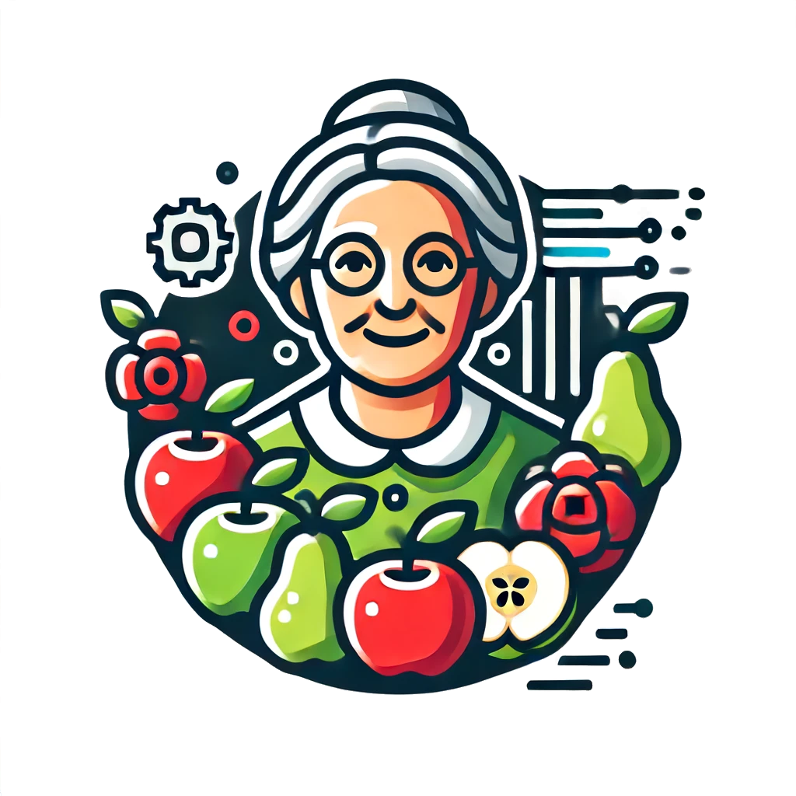

Granny
======
**Granny** is going to rate your fruits!

Granny is an image analysis software that uses AI to segmentation images of individual fruit in photos, and then process the images to extract individual ratings. Granny, aims to provide an open-source, freely available tool for post-harvest fruit quality assessment. 

.. toctree::
   :maxdepth: 1
   :caption: Contents: 
   
   users_guide/index
   dev_guide/index
   acknowledgements
