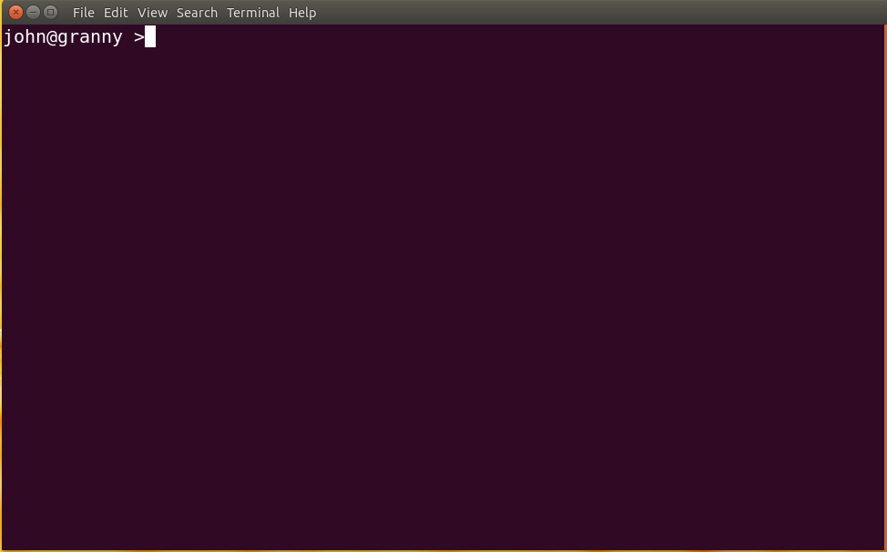

Installation
============
Granny was built using Python3 and can be run on any modern operating system including Windows, variants of Linux and OS X. Currently to install Granny, you must use the command-line interface. Follow the installation instructions that match the operating system you are using. 


Opening the terminal
--------------------

Windows
```````
.. note::

    Instructions will be added here.

OS X
````

.. note::

    Instructions will be added here.

Ubuntu 22.04 Linux
``````````````````
The command-line interface for Granny can be opened by clicking on Ubuntu icon on the task bar:


Search for "terminal" in the search box that appears.  Click the icon with the title "terminal" and the terminal should appear:



Within the terminal you can type the commands to install Granny.


Install the Most Recent Release
-------------------------------
Windows
```````

.. note::

    Instructions will be added here.


Linux: Ubuntu 22.04
```````````````````
Python3 comes pre-installed on Ubuntu. You can install Granny along with all its dependencies using the `pip3` command in the terminal in the following way:

.. code:: bash

    pip3 install granny

You will see output printed to the terminal as the installation progresses. If successful, you will see something similar to the following:

::

    Installing collected packages: granny
    Successfully installed granny-1.0a0


Mac OS X
```````

.. note::

    Instructions will be added here.

Install the Development Version
-------------------------------
For most users, the development version of Granny should not be used.  This is where leading-edge code is housed before it gets added to a release version. However, if you would like to explore using the development version, perhaps to test new features, you can install following these instructions.

.. warning::

    The development version of Granny may not be stable.  If you have any issues using this version please post an issue on the `Granny GitHub issue queue <https://github.com/SystemsGenetics/granny/issues>`_.

To retrieve granny you must have `git installed <https://git-scm.com/book/en/v2/Getting-Started-Installing-Git>`.  In the terminal run the following commands:


.. code:: bash

    git clone -b dev https://github.com/SystemsGenetics/granny.git

This command will pull the most recent version of the Granny code from the `dev` (development) branch.

You can then install the development version of granny by specifying the path to where you "cloned" Granny. For example on Ubuntu 22.04 the command would like the following.

.. code:: bash

    pip3 install ./granny

