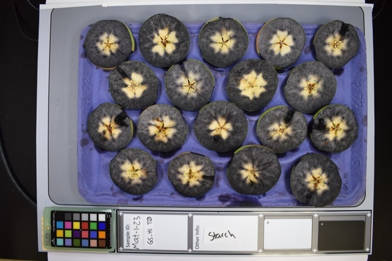

About Granny
============

.. figure:: ../_static/granny_logo_transparent.png
   :width: 25%
   :align: center
   :alt: Granny rating software logo

Why is Granny Needed?
---------------------
Quality assessment of pome fruits (i.e. apples and pears) is crucial for determining the optimal harvest time, and the progression of fruit-quality attributes during storage. This evaluation often includes careful visual assessments of fruit for apparent defects and physiological symptoms. A general best practice for quality assessment is to rate fruit using the same individual rater or group of individuals raters to reduce bias. However, such consistency across labs, facilities, and experiments is often not feasible or attainable. Visual human assessments are coarse-grained and lack consistent objective criteria. 

Granny, is a designed for rating fruit using machine-learning and image-processing to address rater bias and improve resolution. Granny also provides ratings compatible with long-established standards and references, promoting continuity. 

What Does Granny Provide?
-------------------------
Current Granny ratings include the following:

- Starch content assessment.
- Incidence of superficial scald.
- Pear color.
- Level of blush in pears.

How Good is Granny?
------------------- 
All of Granny's current rating modules show high levels of concordance with expert human raters. You can find specific results in the manuscript listed in the `Citing Granny`_ section below.

How to run Granny?
------------------
Currently, Granny is a command-line software tool.  Here we provide some instructions for using the command-line and running Granny, but knowing how to use the command-line is needed.  We are currently working on a graphical and mobile application for Granny that will make it more easily accessible for everyone.  

Rating fruit with Granny consists of only two separate steps:

- Image segmentation
- Fruit rating

Segmentation is the step where an image of apples on a tray (such as in the image below) is divided into individual apple images. This step uses Artificial Intelligence computer vision techniques to identify fruit within in an image.  Next, each individual fruit can be rated.

This User's Guide will provide step-by-step instructions for how to use the command-line to perform both segmentation and fruit rating.

Citing Granny
-------------
If you would like to cite Granny, please use the following:

Nhan H. Nguyen, Joseph Michaud, Rene Mogollon, Huiting Zhang, Heidi Hargarten, Rachel Leisso, Carolina A. Torres, Loren Honaas, Stephen Ficklin. `Rating Pome Fruit Quality Traits Using Deep Learning and Image Processing <https://doi.org/10.1101/2024.04.03.588000>`_. bioRxiv 2024.04.03.588000 