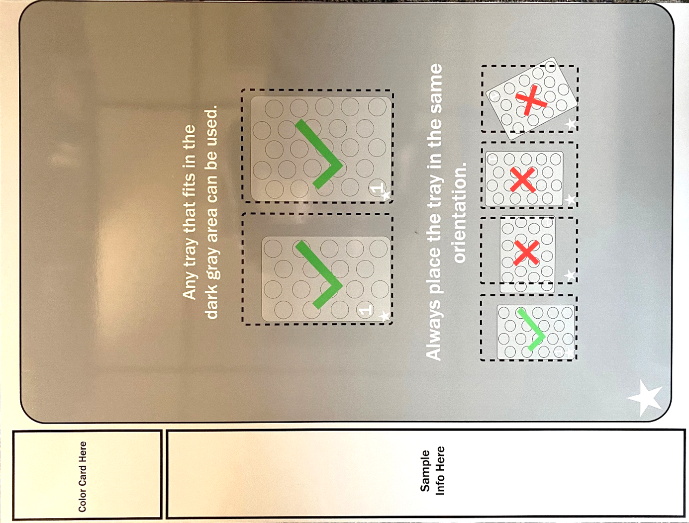
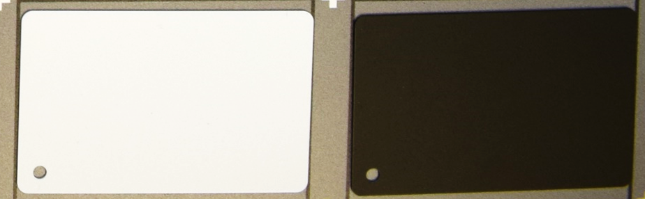
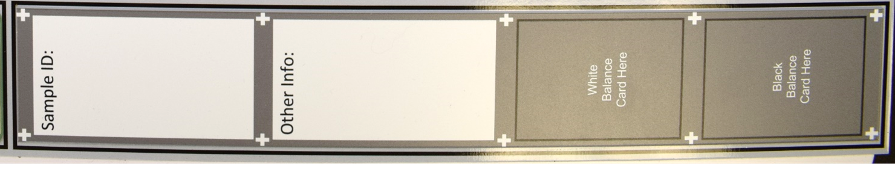
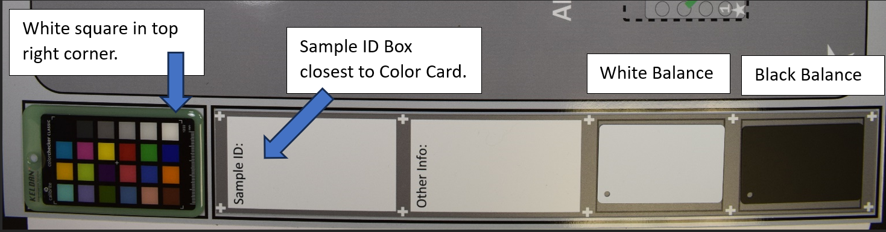
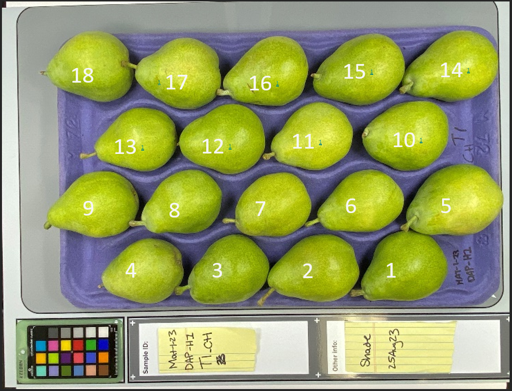

Imaging Station
===============
For best performance with Granny, it is recommended to use an imaging station to capture high-quality images with consistent lighting.  The following provides a description of a design and standard operating procedures. 

:Updated: 
    19 September 2023
    Honaas Lab – USDA-ARS TFRL

:Setup Version:
    1.0

:Questions:    
    Heidi Hargarten – USDA-ARS TFRL (Concepts/Design): heidi.hargarten@usda.gov
    Loren Honaas – USDA-ARS TFRL (Principal Investigator): loren.honaas@usda.gov


Image Station Components
------------------------
The following is a list of items you will need to construct the imaging station. 

Image Station Template
``````````````````````


Color Card
```````````
.. figure:: ../_static/image_station6.jpg

White and Black Balance Cards
`````````````````````````````


Annotation Plate 2 
``````````````````
Includes spaces for white and black balance cards.



Block 
`````
Used to elevate Color Card so fruit or tray do not cast shadows on the Color Card.

.. figure:: ../_static/image_station9.jpg

Not Pictured
````````````
- Microfiber Cloth
- 4cm Block
- Calibrite Color Checker Classic Target
 

Image Station Standard Operating Procedures
-------------------------------------------

Step 1: Place Template in Imaging Station
````````````````````````````````````````
Place Image Station Template in imaging station so the boxes that say, ‘Color Checker Here’ and ‘Sample Info Here’ are closest to the front/opening/user of the imaging station.

Example: View if user is standing in front of image station

.. figure:: ../_static/image_station1.jpg


Step 2: Place Fruit
```````````````````
Place tray containing fruit, starch discs, etc. in dark grey area.

- Always place tray in the same orientation.
- ‘Fruit #1’ starts at the star, if possible.
- Orient whole fruit so stems don’t overlap Sample ID information.
- Arrange fruit, starch discs, etc. so that they are on a level plane (not tilted, skewed, etc).

Step 3: Place Color Card
````````````````````````
Place Color Card in light grey box that says, ‘Color Card Here’.

- Make sure Color Card is clean.
- Orient so white square is in the top right corner of this box.
- Use blocks as needed to elevate the Color Card so fruit do not overlap or cast shadows on the Color Card.

Step 4: Place Annotation Plate
```````````````````````````````
Place Annotation Plate with Sample Information in the light grey box that says, ‘Sample Info Here’.

- Orient so Sample Info appears at the top of the box, closes to the color card.
- Paper labels, bin tags, bar codes, etc can be placed inside the white box.
- Place Black and White Balance Cards in appropriate positions.

.. note::
    
    Sample information can be written directly onto ONLY the thinner, laminated Annotation Plate using a dry erase marker.

.. note::
    
    Writing must be contained within the white boarder of the ‘Sample ID’ and ‘Other Info’ boxes. The white ‘plus’ symbols must be visible for AI software to detect regions for image-to-text and black and white balances.


The following figure demonstrates the orientation of color card and annotation plate:



Step 5: Check Setup
```````````````````
Ensure all components (tray of fruit, Color Card, and Annotation Plate) are inside their respective boxes and oriented properly within the camera view finder. The following image shows the proper orientation of all components

.. figure:: ../_static/image_station3.jpg


Step 6: Image Collection
`````````````````````````
- Next, take an image, ensuring that all all components of the image template are present in the image. 
- When done, remove the Color Card, Black and White Balance Cards, Annotation Plate, and then the tray of fruit (if need be).
- Repeat steps 2-6 as needed.

Step 7: Cleaning
`````````````````
When imaging session is complete, clean the imaging station.

- Gently clean Color Checker card with warm water and a microfiber cloth. Dry completely before storing in light proof housing.
- Wipe down Image Station Template and Annotation Plate with a damp rag or paper towel to clean off juice, starch stain solution, dust, debris, etc.

Image Station ‘Best’ Practices
------------------------------
- Take photos in RAW format.
- Orient tray so ‘fruit 1’ starts at the star. Fruits will be automatically extracted in the order as shown in figure below. 
  - Customizable fruit extraction order possible in the GRANNY software.
- Use block to elevate color checker to prevent shadowing over fruit.
- Clean Color Card as needed during imaging session.
- Record image number on data sheet or within a digital record keeping system. 
- Download images to a computer or upload to a cloud-based server at the end of every imaging session.



Color Checker Card Care
-----------------------
- When not in use, store the color checker card in a light resistant cardboard housing (or other case)
- Clean Color Card with warm water and microfiber cloth or other delicate task wipes such as lens wipes.
  
  - Buff out water streaks.
  - Coarse paper towels may scratch resin coating and dull surface over time – this will decrease the life of the Color Checker card.
  - Starch Stain Solution may discolor Color Checker card and render useless.
  
- **On an annual basis**, the Color Checker Card should be checked against a Calibrite Color Checker Classic target to ensure the resin is not becoming discolored or dulled. If the Color Checker card does not pass this annual ‘calibration’, a replacement should be purchased.
