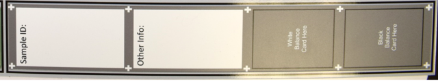

Imaging Station
===============
For best performance with Granny, it is recommended to use an imaging station to capture high-quality images with consistent lighting.  The following provides a description of a design and standard operating procedures. This protocol is versioned:

:Protocol and Template Version:
    1.2

:Updated: 
    19 September 2023
    Honaas Lab - USDA-ARS TFRL
    
:Questions:    
    Heidi Hargarten - USDA-ARS TFRL (Concepts/Design): heidi.hargarten@usda.gov
    Loren Honaas - USDA-ARS TFRL (Principal Investigator): loren.honaas@usda.gov


Image Station Components
------------------------
The following is a list of items you will need to construct the imaging station. 

Image Station Template
``````````````````````
To aid image processing for Granny, an image station template mat has been created. It has different section specifically for placing a color card, black and white balance cards, written annotations and a tray of fruit. The template pictured below was printed on laminated Styrene signboard at FedEx. A powerpoint file is available with the template, including specific dimensions that can be provided to a printing company for printing.  The following image shows how the template looks.

:Download:

    `ImageStationTemplate_V1.2.pptx <../_static/users_guide/ImageStationTemplate_V1.2.pptx>`_


Color Card
```````````
The color card is a Calibrite ColorChecker card (`here <https://calibrite.com/us/product/colorchecker-classic-mini/>`_ (date link provided: 12 July 2024)) embedded in an epoxy resin made by Keldan Lights (`here <https://keldanlights.com/products/accessories/color-management/1558-color-checker-and-gray-card.html>`_ (date link provided: 12 July 2024)). Originally designed for underwater photography, this resined color card is durable and can be cleaned simply with warm water and a microfiber cloth. It can be purchased directly through Keldan, or from 3rd party vendors such Backscatter Photography (`here <https://www.backscatter.com/Keldan-Color-Checker-and-Gray-Card>`_ (date link provided: 12 July 2024)).


White and Black Balance Cards
`````````````````````````````
For standard calibration purposes, a white and black balance are added in addtion to the ColorChecker card. The white and black balance cards pictured below are the DGK Color Tools, Standard White Balance Card Set, which can be purchased from standard photography equipment vendors (example `here <https://www.adorama.com/dgk1.html>`_ (date link provided: 12 July 2024)


Annotation Plate 
````````````````
The annotation plate, includes spaces for white and black balance cards. The annotation plate pictured below was printed on matte styrene signboard at FedEx. The powerpoint file provided above includes the annotation plate and the specific dimensions that can be provided to a printing company for printing.  The following image shows how the annotation plate looks.




Block 
`````
Used to elevate the ColorChecker Card so fruit or tray do not cast shadows on the ColorChecker Card. The block pictured here was constructed out of a 2cm thick pine wood board, cut to length (approximately 12.2 cm long and 6.3 cm wide). To increase the height of the block, two blocks can be glued and stacked together using a basic wood glue (creating a 4cm block). The wood block was cut to be smaller than the color card, so the wood block does not extend past the margins of the color card in the final image. Wood block edges were sanded and rounded out to reduce the risk of damage to fruit during set up or tray maniuplation.

To attach the ColorChecker Card to the wood block, a simple 1 inch by 1 inch velcro type fastener can be adhered to the block and to the back (grey side) of the Color card. The fastner appearing in this user guid can be found `here <https://www.amazon.com/Scotch-Rfd7021-Extreme-Fasteners-12-Count/dp/B07FJNC3JG>`_ (date link provided: 27 June 2024).


.. note::
    
    When attaching the adhesive fasteners to the wood block and the color card, you will need to pre-measure to make sure the fastner is centered on the block and the color card to ensure the wood block does not extend past the ColorChecker card margins in the final image.

Not Pictured
````````````
- Microfiber Cloth (Example `here <https://www.amazon.com/Microfiber-Cleaning-Cloth-Towel-Cars/dp/B08BWLHMCZ/ref=sr_1_8?crid=2G6CS2Q6URJ9I&dib=eyJ2IjoiMSJ9.b0tzGlOtk14Nl_CwwVII0UdTuqceZ9Ed01n2TF61d0ecGQBex_760Ukz2gndwvTD64-VCqgte2tajSeHgL36SSbRiwGuUSH6KpcF_FbXYl2QKdLlz2mp80V4pzuul2WCzhJHVp4mnBCrdqWEKYjK2477-vNo_5V8J9GRBA6w1YrmYjSD9RdJwlAMeV1uVf1ZG8HACYz786JR3kgwmn6d9TtgUjzA1HVaeHmgSh6y2aRhCUbxYXlQgZ0u7HAVXgn79X-Yxy3OyA4qOqICeO9S3xjcNMddOTA7dMTY6PRA-aw.5B51rDYsGcXLJgCQl_2GaOP2MYawbDWVG9MkUXeaJKM&dib_tag=se&keywords=microfiber+cloth&qid=1720807847&s=home-garden&sprefix=microfiber+cloth%2Cgarden%2C183&sr=1-8>`_ (date link provided: 12 July 2024))
- 4cm Block
- Calibrite ColorChecker Classic Target (`here <https://calibrite.com/us/product/colorchecker-classic-mini/>`_ (date link provided: 12 July 2024))
 

Image Station Standard Operating Procedures
-------------------------------------------

Step 1: Place Template in Imaging Station
`````````````````````````````````````````
Place Image Station Template in imaging station so the boxes that say, ‘Color Card Here’ and ‘Sample Info Here’ are closest to the front/opening/user of the imaging station.

Example: View if user is standing in front of image station


Step 2: Place Fruit
```````````````````
Place tray containing fruit, starch discs, etc. in dark grey area.

- Always place tray in the same orientation.
- ‘Fruit #1’ starts at the star, if possible.
- Orient whole fruit so stems don’t overlap Sample ID information.
- Arrange fruit, starch discs, etc. so that they are on a level plane (not tilted, skewed, etc).

Step 3: Place Color Card
````````````````````````
Place ColorChecker Card in light grey box that says, ‘Color Card Here’.

- Make sure ColorChecker Card is clean.
- Orient so white square is in the top right corner of this box.
- Use blocks as needed to elevate the ColorChecker Card so fruit do not overlap or cast shadows on the ColorChecker Card.

Step 4: Place Annotation Plate
```````````````````````````````
Place Annotation Plate with Sample Information in the light grey box that says, ‘Sample Info Here’.

- Orient so Sample Info appears at the top of the box, closes to the color card.
- Paper labels, bin tags, bar codes, etc can be placed inside the white box.
- Place Black and White Balance Cards in appropriate positions.

.. note::
    
    Sample information can be written directly onto ONLY the thinner, laminated Annotation Plate using a dry erase marker.

.. note::
    
    Writing must be contained within the white boarder of the ‘Sample ID’ and ‘Other Info’ boxes. The white ‘plus’ symbols must be visible for AI software to detect regions for image-to-text and black and white balances.


The following figure demonstrates the orientation of ColorChecker card and annotation plate:

.. figure:: ../_static/users_guide/image_station2.png

Step 5: Check Setup
```````````````````
Ensure all components (tray of fruit, ColorChecker Card, and Annotation Plate) are inside their respective boxes and oriented properly within the camera view finder. The following image shows the proper orientation of all components


Step 6: Image Collection
`````````````````````````
- Next, take an image, ensuring that all all components of the image template are present in the image. 
- When done, remove the ColorChecker Card, Black and White Balance Cards, Annotation Plate, and then the tray of fruit (if need be).
- Repeat steps 2-6 as needed.

Step 7: Cleaning
`````````````````
When imaging session is complete, clean the imaging station.

- Gently clean ColorChecker Checker card with warm water and a microfiber cloth. Dry completely before storing in light proof housing.
- Wipe down Image Station Template and Annotation Plate with a damp rag or paper towel to clean off juice, starch stain solution, dust, debris, etc.

Image Station ‘Best’ Practices
------------------------------
- Take photos in RAW format if possible/feasible (possible for digital cameras only).
- Orient tray so ‘fruit 1’ starts at the star. Fruits will be automatically extracted in the order as shown in figure below. 
  - Customizable fruit extraction order possible in the GRANNY software.
- Use block to elevate color checker to prevent shadowing over fruit.
- Clean ColorChecker Card as needed during imaging session.
- Record image number on data sheet or within a digital record keeping system. 
- Download images to a computer or upload to a cloud-based server at the end of every imaging session.


ColorChecker Card Care
-----------------------
- When not in use, store the ColorChecker card in a light resistant cardboard housing (or other case)
- Clean ColorChecker Card with warm water and microfiber cloth or other delicate task wipes such as lens wipes.
  
  - Buff out water streaks.
  - Coarse paper towels may scratch resin coating and dull surface over time - this will decrease the life of the ColorChecker card.
  - Starch Stain Solution may discolor Color Checker card and render useless.
  
- **On an annual basis**, the ColorChecker Card should be checked against a Calibrite ColorChecker Classic target (`here <https://calibrite.com/us/product/colorchecker-classic-mini/>`_ (date link provided: 12 July 2024)) to ensure the resin is not becoming discolored or dulled. If the ColorChecker card does not pass this annual ‘calibration’, a replacement should be purchased.
