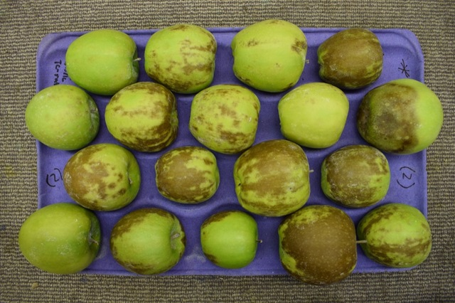

Rating Superficial Scald
=================================================

.. attention::
    
    :ref:`Step 2: Run Segmentation` must be performed before using this rating module.

This module will determine the ratio of superficial scald on a piece of fruit. The module will output the results as a ``results.csv`` file that can be opened in Microsoft Excel or another spreadsheet program. The results include: the ratio of superficial scald vs total fruit area (rating) for each individual piece of fruit. Granny's scald rating module will also report an average tray level superficial scald rating. 

Example of starch rating command line usage:

.. code:: bash

    granny -i cli --action scald --image_dir ./results/segmentation/<date_and_time_of_run>

   Example image of tray that Granny scald can process.

.. attention::
    
    The image above shows a tray that ultimately will get rated for scald however, in practice, users must perform segmentation before rating superficial scald.
 

.. csv-table:: Scald Rating Results .csv
    :header: Name,rating,TrayName

    scald_example_1.png,0.05861743610519554,scald_example
    scald_example_10.png,0.6306813742387682,scald_example
    scald_example_11.png,0.5759842384078588,scald_example
    scald_example_12.png,0.7853690476382467,scald_example
    scald_example_13.png,0.7230023117519125,scald_example
    scald_example_14.png,0.07240419578876933,scald_example
    scald_example_15.png,0.44484797970755896,scald_example
    scald_example_16.png,0.8488585551665427,scald_example
    scald_example_17.png,0.3364370071189393,scald_example
    scald_example_18.png,0.12257072380303646,scald_example
    scald_example_2.png,0.34148965387696784,scald_example
    scald_example_3.png,0.9351626861577397,scald_example
    scald_example_4.png,0.030244610838261132,scald_example
    scald_example_5.png,0.6816636184753969,scald_example
    scald_example_6.png,0.5640562665292035,scald_example
    scald_example_7.png,0.01971690192140363,scald_example
    scald_example_8.png,0.02627684189524393,scald_example
    scald_example_9.png,0.3658700283475841,scald_example

Each segmented image with a mask of the scald is located in ``/results/scald/<date and time of run>`` directory, users can navigate to this directory to check what is being used in the scald rating. This is also where the scald rating ``results.csv`` file (shown in table above) will be output. 

