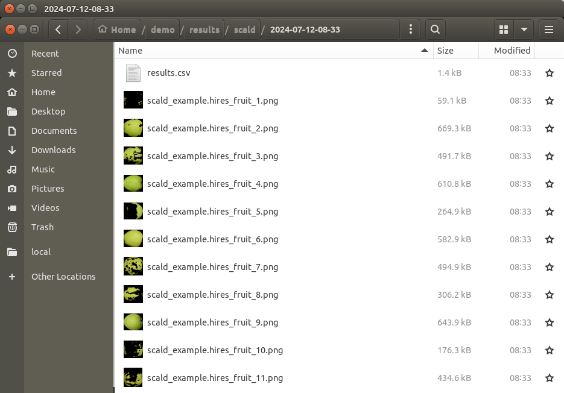
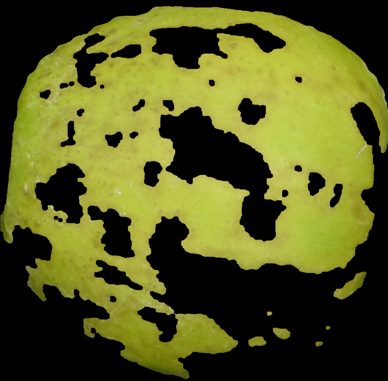

Rating Superficial Scald
========================

This scald rating module will determine the ratio of superficial scald on a piece of fruit. 

Segmentation for Scald Rating
-----------------------------
Prior to running this module, :ref:`Step 2: Run Segmentation` must be performed so that apples on the tray can be separated into individual images. To follow along with this tutorial, you can use the following image:

.. figure:: ../../../_static/users_guide/scald_example.hires.JPG
   :align: center
   :width: 50%

   Demo image for scald analysis.

Rate Superficial Scald
----------------------
Inside of your Granny project directory (created in the :ref:`Step 1: Project Setup`), you should have performed the segmentation step before proceeding with scald analysis. Now, you will run the `scald` analysis on the command-line. Like the segmentation step, you must provide several arguments. The following table lists the arguments needed for the `scald` analysis:

.. csv-table::
   :header: "Granny Options", "Description"
   :widths: auto

   "``-i cli``", "Indicates you want to use the command-line interface."
   "``--analysis scald``", "Indicates you want to run the scald analysis."
   "``--input``", "The directory where the segmented images of whole apples are kept."

Similar to the segmentation step, when you specify the ``--input`` argument, you can drag and drop the folder where the images from the segmentation step are stored. This will be the ``segmented_images`` folder created during the `segmentation` step.  For example if the results from segmentation are in this location  ``/home/johns_smith/demo/results/segmentation/22024-07-12-08-30/segmented_images`` then your command line will look like the following:

.. code:: bash

    granny -i cli --analysis scald --input /home/john_smith/demo/results/segmentation/2024-07-12-08-30/segmented_images

.. note::

    Remember, you can drag and drop a folder from the file browser into the terminal so you do not have to type the full directory path.

While running the scald analysis, Granny will output something similar to the terminal:

::

	input                    : (user) ./results/segmentation/2024-07-12-08-30/segmented_images/

Scald Rating Results
--------------------
Similar to the segmentation step, a new folder named ``scald`` will be created in the ``results`` results folder. It too will have a sub folder with the date the analysis was run.  Inside this folder will be the results file named ``results.csv`` and images of each apple, with scald regions having been removed.

The ``results.csv`` file can be opened using Microsoft Excel or another spreadsheet program. The file includes the segmented image name and the "rating" which is the ratio of scald vs total fruit area. 

.. csv-table:: Scald Rating Results .csv
    :header: Name,rating,TrayName

    scald_example_1.png,0.05861743610519554,scald_example
    scald_example_10.png,0.6306813742387682,scald_example
    scald_example_11.png,0.5759842384078588,scald_example
    scald_example_12.png,0.7853690476382467,scald_example
    scald_example_13.png,0.7230023117519125,scald_example
    scald_example_14.png,0.07240419578876933,scald_example
    scald_example_15.png,0.44484797970755896,scald_example
    scald_example_16.png,0.8488585551665427,scald_example
    scald_example_17.png,0.3364370071189393,scald_example
    scald_example_18.png,0.12257072380303646,scald_example
    scald_example_2.png,0.34148965387696784,scald_example
    scald_example_3.png,0.9351626861577397,scald_example
    scald_example_4.png,0.030244610838261132,scald_example
    scald_example_5.png,0.6816636184753969,scald_example
    scald_example_6.png,0.5640562665292035,scald_example
    scald_example_7.png,0.01971690192140363,scald_example
    scald_example_8.png,0.02627684189524393,scald_example
    scald_example_9.png,0.3658700283475841,scald_example

In addition to the results file, a copy of each segmented image is present. The area of the fruit that is not stained by iodine is removed, leaving blackness where scald was detected. 

Granny's scald rating module will also report an average tray level scald rating in the ``tray_summary.csv`` file. 

.. csv-table:: tray_summary.csv
    :header: TrayName,rating 
    
    scald_example.hires_fruit,0.410304227338372
