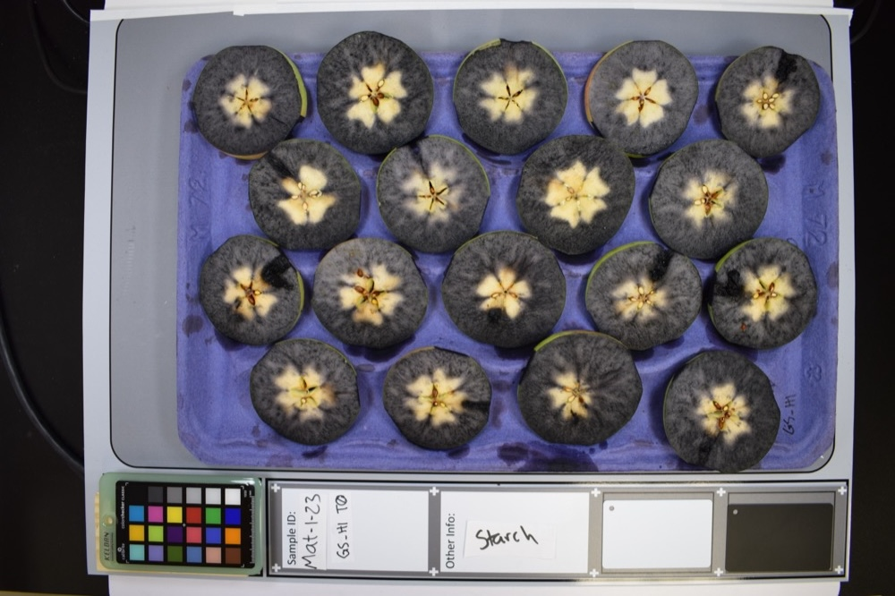
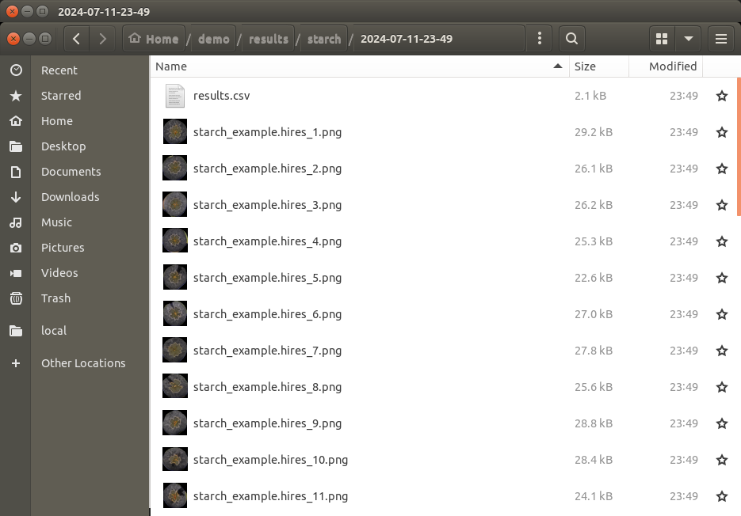
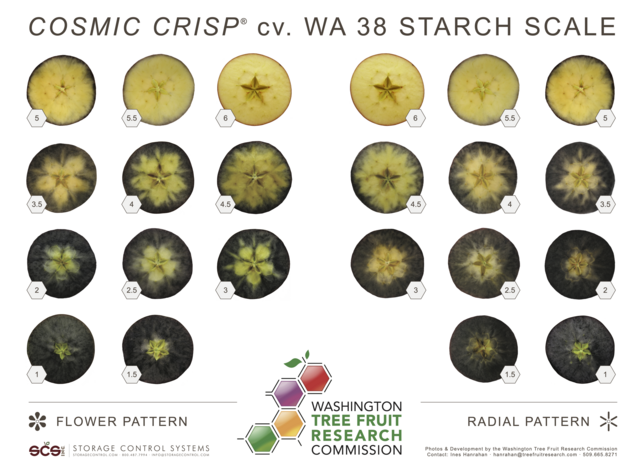
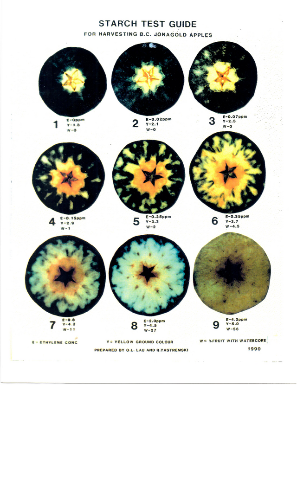
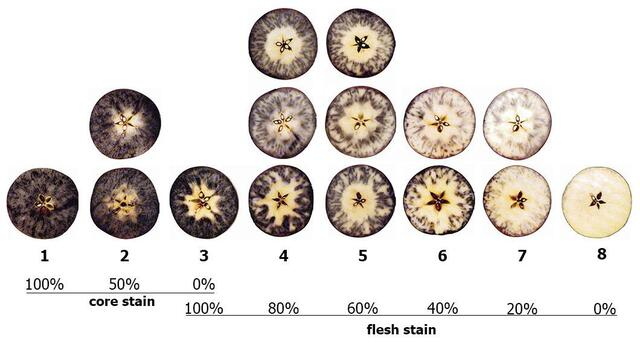
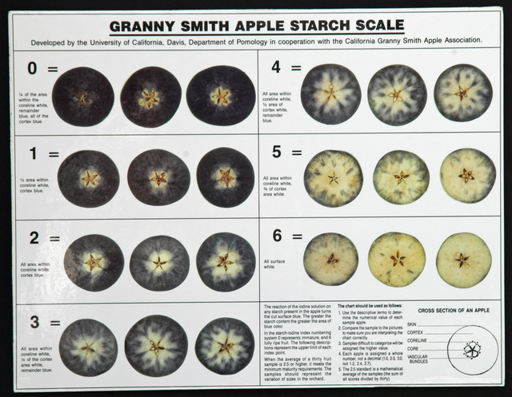
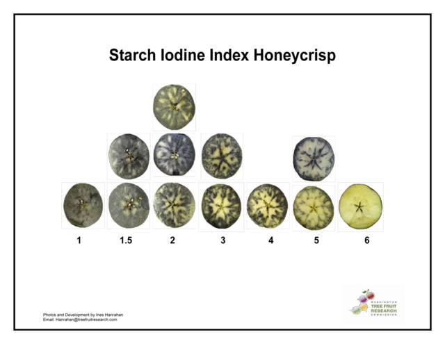
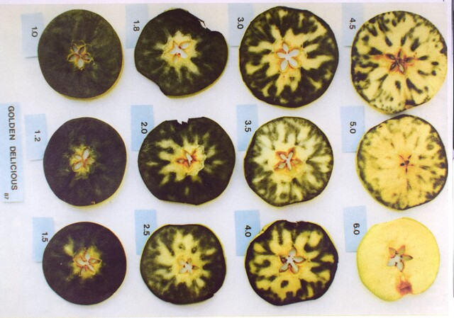
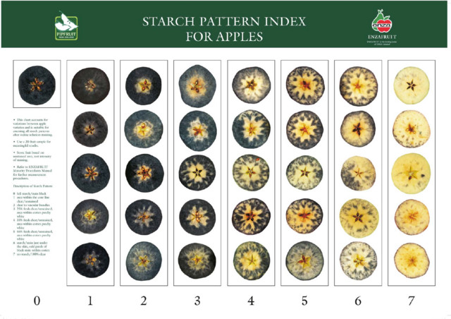
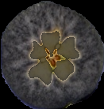

Rating Starch Content
=====================

The starch rating module of Granny is used to determine the ratio of starch in a cross-sectioned fruit treated with potassium iodide and iodine solution (Lugol’s solution). 

Segmentation for Starch Rating
------------------------------
Prior to running this module, :ref:`Step 2: Run Segmentation` must be performed so that apples on the tray can be separated into individual images. To follow along with this tutorial, you can use the following image:

   Demo image for starch analysis.

Rate Starch Clearing
--------------------
Inside of your Granny project directory (created in the :ref:`Step 1: Project Setup`), you should have performed the segmentation step before proceeding with starch analysis. Now, you will run the `starch` analysis on the command-line. Like the segmentation step, you must provide several arguments. The following table lists the arguments needed for the `starch` analysis:

.. csv-table::
   :header: "Granny Options", "Description"
   :widths: auto

   "``-i cli``", "Indicates you want to use the command-line interface."
   "``--analysis starch``", "Indicates you want to run the starch analysis."
   "``--input``", "The directory where the segmented images of apple cross-sections, stained with iodine are kept."

Similar to the segmentation step, when you specify the ``--input`` argument, you can drag and drop the folder where the cross-section images from the segmentation are stored. This will be the ``segmented_images`` folder created during the `segmentation` step.  For example if the results from segmentation are in this location  ``/home/johns_smith/demo/results/segmentation/2024-07-11-23-34/segmented_images`` then your command line will look like the following:

.. code:: bash

    granny -i cli --analysis starch --input /home/john_smith/demo/results/segmentation/2024-07-11-23-34/segmented_images/

.. note::

    Remember, you can drag and drop a folder from the file browser into the terminal so you do not have to type the full directory path.

While running the starch analysis, Granny will output something similar to the terminal:

::

        input                    : (user) /home/john_smith/demo/results/segmentation/2024-07-11-23-34/segmented_images/

Starch Rating Results
---------------------
Similar to the segmentation step, a new folder named ``starch`` will be created in the ``results`` results folder. It too will have a sub folder with the date the analysis was run.  Inside this folder will be the results file named ``results.csv`` and images of each apple, with regions of starch colored in a dark gray transparent mask.

The ``results.csv`` file can be opened using Microsoft Excel or another spreadsheet program. The file includes the segmented image name and the "rating" which is the ratio of starch vs total fruit area. 

.. csv-table:: results.csv
    :header: Name,HONEY_CRISP,WA38_1,WA38_2,ALLAN_BROS,GOLDEN_DELICIOUS,GRANNY_SMITH,JONAGOLD,CORNELL,rating,TrayName

    Starch_Example_1.png,2.0,2.0,2.0,3.0,2.5,2.0,3.0,3.0,0.8275881338459019,Starch_Example
    Starch_Example_10.png,2.0,1.0,1.5,3.0,1.8,1.0,1.0,2.0,0.8983110712752987,Starch_Example
    Starch_Example_11.png,2.0,1.0,1.5,3.0,2.0,1.0,1.0,2.0,0.8867611920385217,Starch_Example
    Starch_Example_12.png,2.0,2.0,2.0,3.0,2.0,1.0,2.0,3.0,0.8661693244509445,Starch_Example
    Starch_Example_13.png,2.0,2.0,2.0,3.0,2.0,2.0,2.0,3.0,0.8421116759081523,Starch_Example
    Starch_Example_14.png,2.0,1.0,1.5,3.0,1.8,1.0,1.0,2.0,0.9007135222578502,Starch_Example
    Starch_Example_15.png,1.5,1.0,1.0,2.0,1.8,0.0,1.0,2.0,0.9342149520786537,Starch_Example
    Starch_Example_16.png,2.0,2.0,2.0,3.0,2.0,2.0,2.0,3.0,0.848105147965976,Starch_Example
    Starch_Example_17.png,3.0,2.0,2.0,3.0,2.5,2.0,3.0,3.0,0.8206200635519464,Starch_Example
    Starch_Example_18.png,2.0,1.0,1.5,3.0,2.0,1.0,1.0,2.0,0.8835256379566238,Starch_Example
    Starch_Example_2.png,2.0,2.0,2.0,3.0,2.0,2.0,2.0,3.0,0.8447790269452538,Starch_Example
    Starch_Example_3.png,3.0,2.0,2.0,3.0,2.5,2.0,3.0,3.0,0.8132964616426851,Starch_Example
    Starch_Example_4.png,2.0,2.0,2.0,3.0,2.0,1.0,2.0,2.0,0.8705057411194589,Starch_Example
    Starch_Example_5.png,2.0,2.0,2.0,3.0,2.0,1.0,2.0,3.0,0.8648159588284796,Starch_Example
    Starch_Example_6.png,3.0,3.0,3.0,4.0,2.5,2.0,3.0,3.0,0.7896696619296992,Starch_Example
    Starch_Example_7.png,2.0,2.0,2.0,3.0,2.0,1.0,2.0,3.0,0.8531637571421742,Starch_Example
    Starch_Example_8.png,2.0,2.0,2.0,3.0,2.5,2.0,2.0,3.0,0.8361481835625268,Starch_Example
    Starch_Example_9.png,2.0,1.0,1.5,3.0,2.0,1.0,1.0,2.0,0.8887840435946733,Starch_Example

To compare Granny's rating with commonly used starch rating scales, Granny provides additional columns with the estimated rating for several of the starch rating scales that are commonly used.Below are links to the starch card images used for the corresponding starch rating in Granny. 

.. csv-table:: Corresponding Starch Rating 
    :header: HONEY_CRISP,WA38_1,WA38_2,ALLAN_BROS,GOLDEN_DELICIOUS,GRANNY_SMITH,JONAGOLD,CORNELL

    |Honey Crisp|, |WA 38|, |WA 38|, |Allan Brothers|, |Golden Delicious|, |Granny Smith|, |Jonagold|, |Cornell|  

In addition to the results file, a copy of each segmented image is present. The area of the fruit that is not stained by iodine is highlighted with a border and gray shading as shown in the following image:

Granny's starch rating module will also report an average tray level starch rating in the ``tray_summary.csv`` file. 

.. csv-table:: tray_summary.csv
    :header: TrayName,HONEY_CRISP,WA38_1,WA38_2,ALLAN_BROS,GOLDEN_DELICIOUS,GRANNY_SMITH,JONAGOLD,CORNELL,rating

    starch_example.hires_fruit,2.14,1.61,1.83,3.00,2.08,1.28,1.78,2.56,0.86

