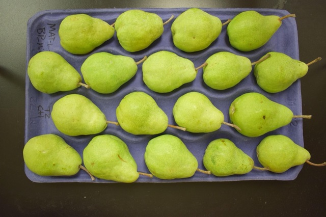

Rating Color in Pears
=====================

.. attention::
    
    :ref:`Step 2: Run Segmentation` must be performed before using this rating module.

This module will determine the color on a piece of fruit. The module will output the results as a ``results.csv`` file that can be opened in Microsoft Excel or another spreadsheet program. The results include: the color vs total fruit area (rating) for each individual piece of fruit. Granny's color rating module will also report an average tray level  color rating. 

Example of starch rating command line usage:

.. code:: bash

    granny -i cli --action color --image_dir ./results/segmentation/<date_and_time_of_run>

   Example image of tray that Granny color can process.

.. attention::
    
    The image above shows a tray that ultimately will get rated for color however, in practice, users must perform segmentation before rating color.
 

.. csv-table:: color Rating Results .csv
    :header: Name,bin,score,distance,location,l,a,b,TrayName

    Color_Example_1.png,4,0.6703007385515274,2.5701832929087227,1.0,50,-26.322850395018868,76.7789415655696,Color_Example
    Color_Example_10.png,4,0.6658633929849465,8.336352263952092,1.0,50,-29.02547515294169,82.9850348118263,Color_Example
    Color_Example_11.png,4,0.6701374471676288,7.6367376298511465,1.0,50,-28.373025690812188,82.69782250378182,Color_Example
    Color_Example_12.png,4,0.6535951040505874,3.133617071437941,1.0,50,-27.89406090871715,75.50936306035446,Color_Example
    Color_Example_13.png,5,0.6753715959925888,4.051033110394391,1.0,50,-26.50410552291817,79.10878136026689,Color_Example
    Color_Example_14.png,5,0.6741239184041659,1.312681760944373,1.0,50,-25.518211322376686,75.73441925043299,Color_Example
    Color_Example_15.png,4,0.6480063978872677,8.455840692272304,1.0,50,-30.627408738199428,80.89491021813136,Color_Example
    Color_Example_16.png,4,0.6537284317989162,6.677376066523931,1.0,50,-29.37904645402284,79.5760682422381,Color_Example
    Color_Example_17.png,5,0.6909861423041394,2.2332073112137967,-1.0,50,-22.86260347145514,73.34407489560121,Color_Example
    Color_Example_18.png,4,0.6546418725558671,2.537014665368667,1.0,50,-27.5586529873822,74.94729670831386,Color_Example
    Color_Example_2.png,4,0.6696602613285434,3.17187455604699,1.0,50,-26.616243957896064,77.41020756921098,Color_Example
    Color_Example_3.png,4,0.6533501374876826,1.5815309659830876,-1.0,50,-25.921479198243475,70.09372223218708,Color_Example
    Color_Example_4.png,5,0.682138070900791,1.3652382736778739,-1.0,50,-23.853295848318478,73.44028702184062,Color_Example
    Color_Example_5.png,4,0.644381792304141,7.286887678376137,1.0,50,-30.435995954170135,79.12515043398662,Color_Example
    Color_Example_6.png,4,0.6540008067887495,1.053554640168655,1.0,50,-26.98415856291395,73.17727182437692,Color_Example
    Color_Example_7.png,4,0.6585493622272056,3.2506899718181748,-1.0,50,-24.838122582834757,68.729236309785,Color_Example
    Color_Example_8.png,4,0.6499018671623829,4.525019766465617,1.0,50,-28.785119627954426,76.66404584678685,Color_Example
    Color_Example_9.png,4,0.6198036457425253,7.130207185838455,1.0,50,-32.46627873591814,75.93724145628157,Color_Example

Each segemented image with a mask of the color is located in ``/results/color/<date and time of run>`` directory, users can navigate to this directory to check what is being used in the color rating. This is also where the color rating ``results.csv`` file (shown in table above) will be output. 