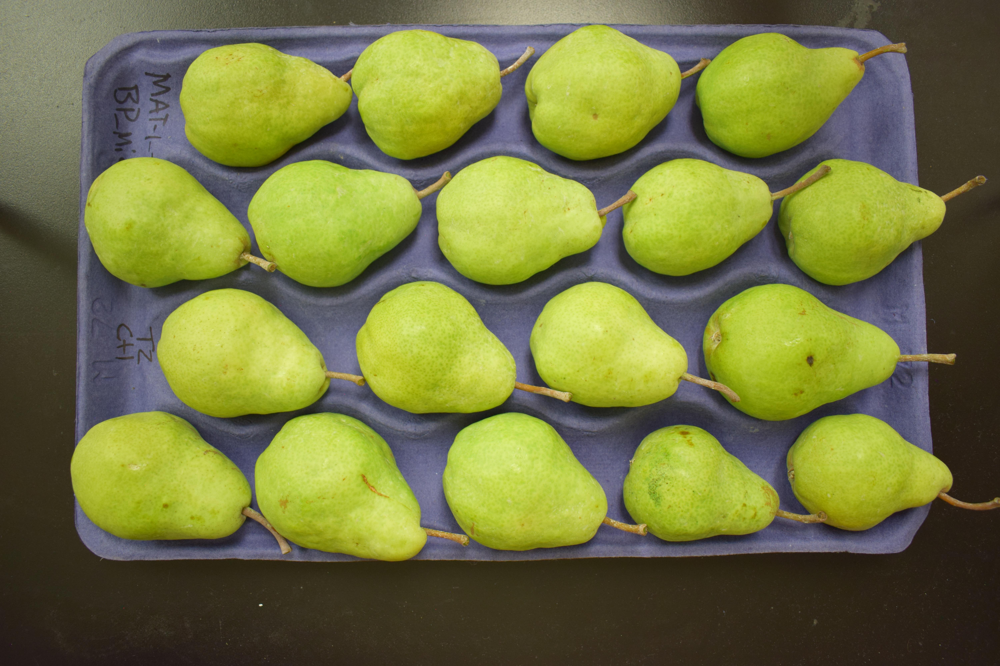
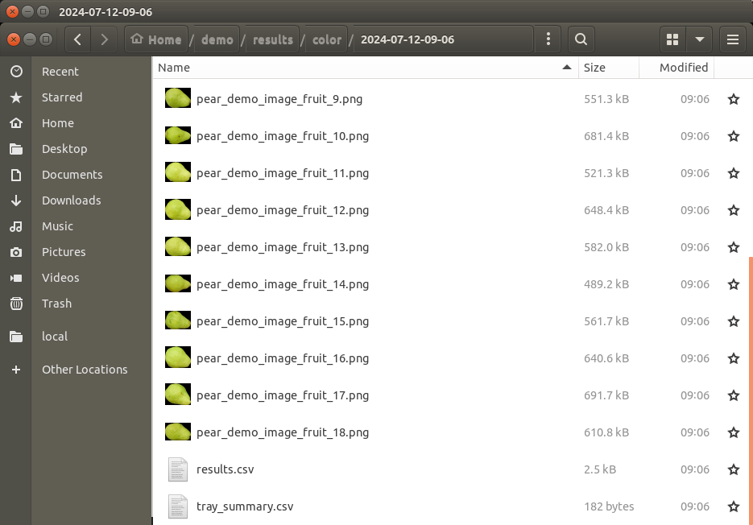
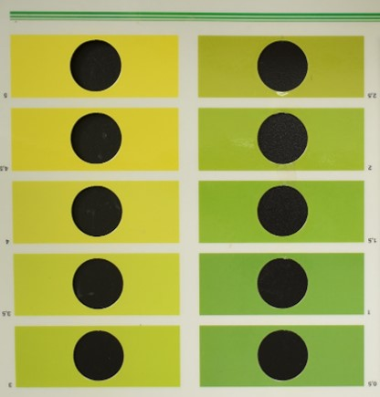

Rating Color in Pears
=====================

This module will determine the color on a piece of fruit. 

Segmentation for Pear Color Rating
----------------------------------

Prior to running this module, :ref:`Step 2: Run Segmentation` must be performed so that pears on the tray can be separated into individual images. To follow along with this tutorial, you can use the following image:

   Demo image for pear color analysis.

Rate Pear Color
---------------
Inside of your Granny project directory (created in the :ref:`Step 1: Project Setup`), you should have performed the segmentation step before proceeding with pear color analysis. Now, you will run the `color` analysis on the command-line. Like the segmentation step, you must provide several arguments. The following table lists the arguments needed for the `color` analysis:

.. csv-table::
   :header: "Granny Options", "Description"
   :widths: auto

   "``-i cli``", "Indicates you want to use the command-line interface."
   "``--analysis color``", "Indicates you want to run the color analysis."
   "``--input``", "The directory where the segmented images of apple cross-sections, stained with iodine are kept."

Similar to the segmentation step, when you specify the ``--input`` argument, you can drag and drop the folder where the images from the segmentation are stored. This will be the ``segmented_images`` folder created during the `segmentation` step.  For example if the results from segmentation are in this location  ``/home/johns_smith/results/segmentation/2024-07-12-09-05/segmented_images`` then your command line will look like the following:

.. code:: bash

    granny -i cli --analysis color --input /home/john_smith/demo/results/segmentation/2024-07-12-09-05/segmented_images

.. note::

    Remember, you can drag and drop a folder from the file browser into the terminal so you do not have to type the full directory path.

While running the color analysis, Granny will output something similar to the terminal:

::

    input                    : (user) /home/john_smith/demo/results/segmentation/2024-07-12-09-05/segmented_images

Pear Color Rating Results
-------------------------
Similar to the segmentation step, a new folder named ``color`` will be created in the ``results`` results folder. It too will have a sub folder with the date the analysis was run.  Inside this folder will be the results file named ``results.csv`` and images of each pear.

The ``results.csv`` file can be opened using Microsoft Excel or another spreadsheet program. The file includes the segmented image name and several rating values.

.. csv-table:: color Rating Results .csv
    :header: Name,bin,score,distance,location,l,a,b,TrayName

    Color_Example_1.png,4,0.6703007385515274,2.5701832929087227,1.0,50,-26.322850395018868,76.7789415655696,Color_Example
    Color_Example_10.png,4,0.6658633929849465,8.336352263952092,1.0,50,-29.02547515294169,82.9850348118263,Color_Example
    Color_Example_11.png,4,0.6701374471676288,7.6367376298511465,1.0,50,-28.373025690812188,82.69782250378182,Color_Example
    Color_Example_12.png,4,0.6535951040505874,3.133617071437941,1.0,50,-27.89406090871715,75.50936306035446,Color_Example
    Color_Example_13.png,5,0.6753715959925888,4.051033110394391,1.0,50,-26.50410552291817,79.10878136026689,Color_Example
    Color_Example_14.png,5,0.6741239184041659,1.312681760944373,1.0,50,-25.518211322376686,75.73441925043299,Color_Example
    Color_Example_15.png,4,0.6480063978872677,8.455840692272304,1.0,50,-30.627408738199428,80.89491021813136,Color_Example
    Color_Example_16.png,4,0.6537284317989162,6.677376066523931,1.0,50,-29.37904645402284,79.5760682422381,Color_Example
    Color_Example_17.png,5,0.6909861423041394,2.2332073112137967,-1.0,50,-22.86260347145514,73.34407489560121,Color_Example
    Color_Example_18.png,4,0.6546418725558671,2.537014665368667,1.0,50,-27.5586529873822,74.94729670831386,Color_Example
    Color_Example_2.png,4,0.6696602613285434,3.17187455604699,1.0,50,-26.616243957896064,77.41020756921098,Color_Example
    Color_Example_3.png,4,0.6533501374876826,1.5815309659830876,-1.0,50,-25.921479198243475,70.09372223218708,Color_Example
    Color_Example_4.png,5,0.682138070900791,1.3652382736778739,-1.0,50,-23.853295848318478,73.44028702184062,Color_Example
    Color_Example_5.png,4,0.644381792304141,7.286887678376137,1.0,50,-30.435995954170135,79.12515043398662,Color_Example
    Color_Example_6.png,4,0.6540008067887495,1.053554640168655,1.0,50,-26.98415856291395,73.17727182437692,Color_Example
    Color_Example_7.png,4,0.6585493622272056,3.2506899718181748,-1.0,50,-24.838122582834757,68.729236309785,Color_Example
    Color_Example_8.png,4,0.6499018671623829,4.525019766465617,1.0,50,-28.785119627954426,76.66404584678685,Color_Example
    Color_Example_9.png,4,0.6198036457425253,7.130207185838455,1.0,50,-32.46627873591814,75.93724145628157,Color_Example

The following provides the meaning of each column in ``results.csv`` file:

   - **Name**: The name of the segmented image. A single pear is contained in each image.
   - **bin**: Granny will estimate a color that best approximates the rating in the color card that is commonly used for pear color rating.  An image of the color card can be found below.
   - **score**: The granny color score rating. The score ranges from 0 to 1, where 1 indicates more yellow fruit and lower numbers more greenish fruit.  Formally, this score is the distance along the line that passes through the color card colors in LAB color space. Please see the published `Granny manuscript <https://www.biorxiv.org/content/10.1101/2024.04.03.588000v1.full>`_ for more detailed information about how this score is calculated. 
   - **distance**: This value indicates the distance from the line that passes through the color card colors in LAB color space.  Because the color card can not include the color of every pear, this number is meant to indicate how "off" the color might be from a traditional color card rating.  The closer to 0 the less "off" it is.
   - **location**: Indicates if the distance value is above (1 value) or below (-1 value) the line.
   - **l**: The "L" channel value in the LAB color space.
   - **a**: The "A" channel value in the LAB color space.
   - **b**: The "B" channel value in the LAB color space.
   - **TrayName**: The name of the original tray image.

The following is an image of the color card that is commonly used to rate pear color. Each color on the card has a unique number from 0.5 (most green) to 5 (most yellow).

Granny's pear color rating module will also report an average tray level color rating in the ``tray_summary.csv`` file. 

.. csv-table:: tray_summary.csv
    :header: TrayName,bin,score,distance,location,l,a,b

    pear_demo_image_fruit,4.22222222222222,0.660048942774391,4.28146103077064,0.555555555555556,50,-27.5796094195362,76.7010994738336
