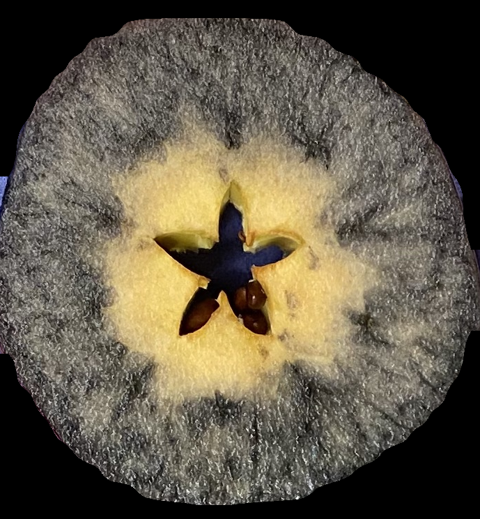
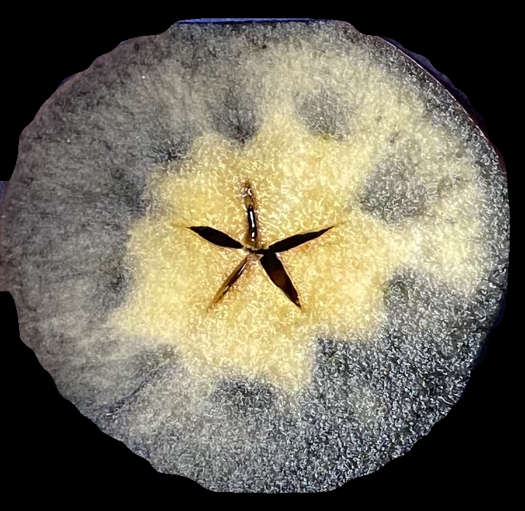
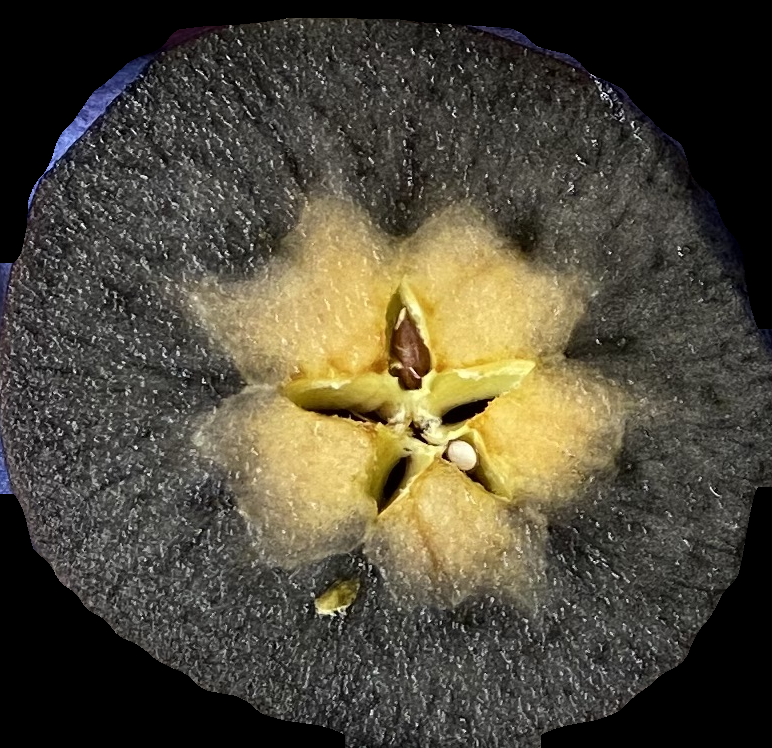
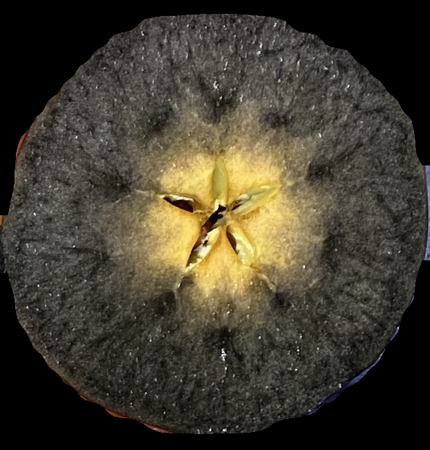
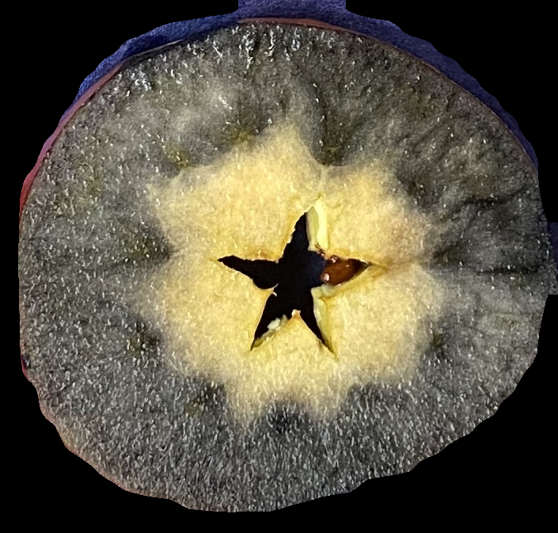
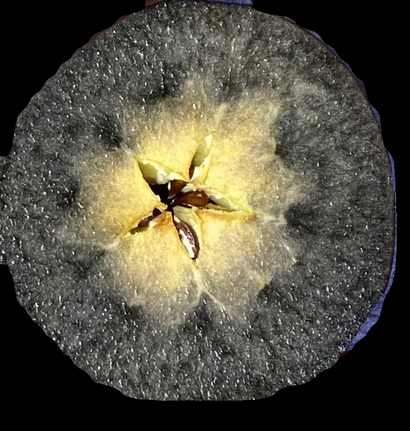
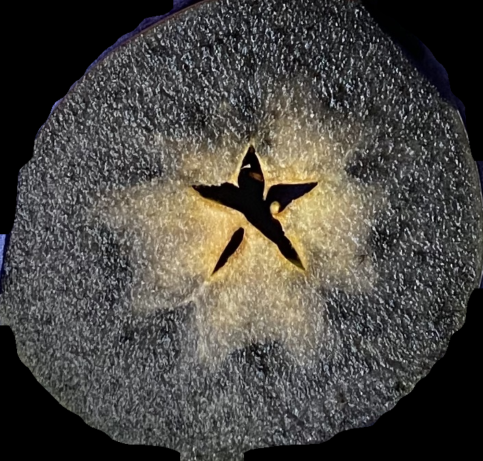
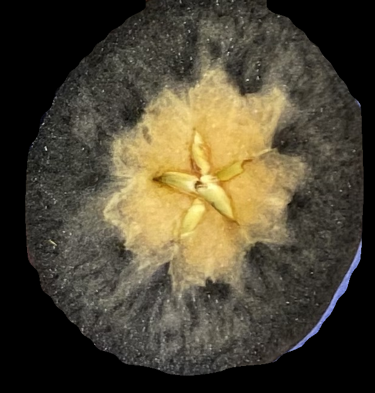

Segment Apples on a Tray into Individual Images for Review and Rating
=================================================

START HERE!

This step will extract each individual apple from the tray into a folder ``results``, run Granny with a ``segmentation`` action::

    granny --action segmentation --image_dir <your_image_dir>
    

.. raw:: html

    

      
      
 

    

Example of an image that will get segmented.

The results folder will contain images like the ones listed below:

1st row:

.. figure:: ../../../demo/cross_section_images/segmented_images/cross_section_demo_image_4.png
    :width: 100

.. figure:: ../../../demo/cross_section_images/segmented_images/cross_section_demo_image_2.png
    :width: 100

.. figure:: ../../../demo/cross_section_images/segmented_images/cross_section_demo_image_1.png
    :width: 100

2nd row:

.. figure:: ../../../demo/cross_section_images/segmented_images/cross_section_demo_image_7.png
    :width: 100

.. figure:: ../../../demo/cross_section_images/segmented_images/cross_section_demo_image_5.png
    :width: 100

3rd row:

.. figure:: ../../../demo/cross_section_images/segmented_images/cross_section_demo_image_13.png
    :width: 100

4th row:

.. figure:: ../../../demo/cross_section_images/segmented_images/cross_section_demo_image_18.png
    :width: 100

.. figure:: ../../../demo/cross_section_images/segmented_images/cross_section_demo_image_16.png
    :width: 100

.. figure:: ../../../demo/cross_section_images/segmented_images/cross_section_demo_image_15.png
    :width: 100

In this ``results`` folder you can review and edit the images that will be included in any downstrream rating modules.

Next, you will point the rating modules to this segmented images ``results`` folder.