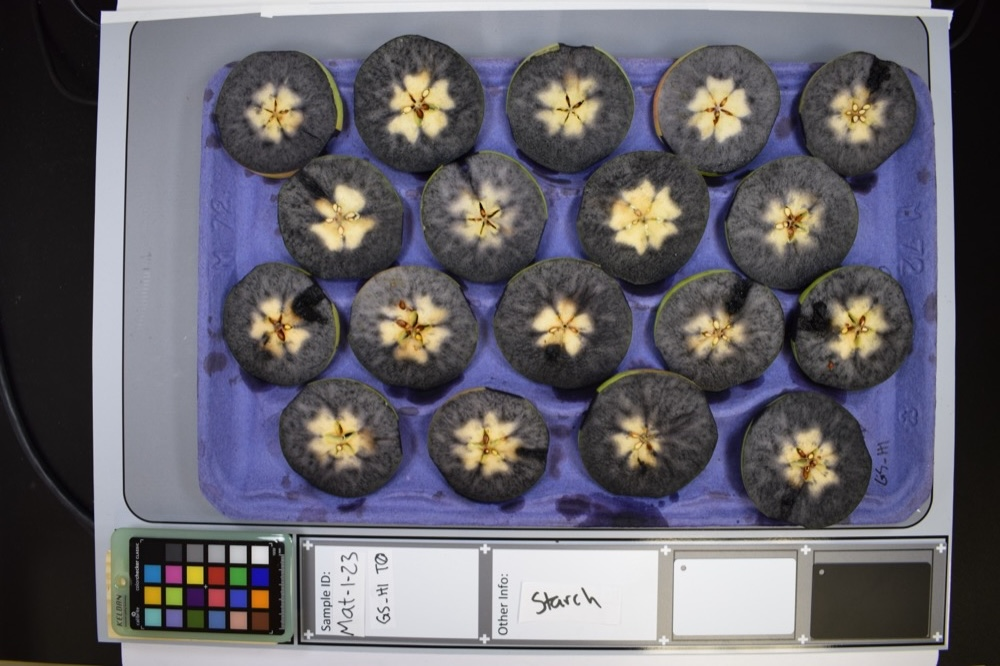
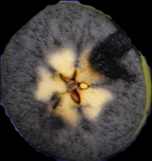

Step 2: Run Segmentation
========================

Before fruit can be rated, each piece of fruit on a tray needs to be in its own image. The  segmentation step takes the image of a tray of fruit and extracts each individual piece of fruit into a new image (see examples below). The fruit itself needs to be isolated from any background material in the image so that the rating modules can analyze only the fruit and none of the other elements in the image. This step needs to be completed before running any of the rating modules in Granny. To follow along with this tutorial, you can download and use the following image (right-click to download). Save the image anywhere on your computer:

   Demo image for segmentation.

.. note::

    You can have as many images of fruit on a tray in a directory as you want. Granny will see and process them all.  For this tutorial, we will only use a single image.

.. warning::

    Make sure that the folder containing tray images only has images of fruit on trays and nothing else. If you are following along with this tutorial the folder will only have one image.

Running the Segmentation Step
-----------------------------
Inside of your Granny project directory (created in the :ref:`Step 1: Project Setup`), you will run Granny on the command-line. You must provide several arguments. For more information about how arguments are provided to Granny, please see :ref:`The Command-Line Interface` section. You will need to tell Granny that `segmentation` is the analysis is to be performed, provide the name of the AI model that can detect fruit, and you will need to tell Granny where the directory is that contains the tray images.

To do this type the following (but do not press enter):

.. code:: bash

    granny -i cli --analysis segmentation --model pome_fruit-v1_0 --input

The following table describes what each argument is for:

.. csv-table::
   :header: "Granny Options", "Description"
   :widths: auto

   "``-i cli``", "Indicates you want to use the command-line interface."
   "``--analysis segmentation``", "Indicates you want to run the segmentation step."
   "``--model``", "Specifies the model that should be used for segmentation to identify fruit.   The model can be specified using a known model name (e.g. 'pome_fruit-v1_0'), and Granny will   automatically retrieve the model from the online https://osf.io. Otherwise the value must be a path to where the model is stored on the local file system. If no model is specified then the default model will be used."
   "``--input``", "The directory where the input tray images are located."

In the command-line example above we did not type the path to the directory where the tray images are kept. Rather than type a long file directory path, you can open your file browser and navigate to the folder where your tray images are stored. Drag and drop this folder into the terminal.  The location where images are stored will be automatically added after the ``--input`` argument.  You now press the enter key to run the command.

The command will look something to the following:

.. code::

    granny -i cli --analysis segmentation --model pome_fruit-v1_0 --input /home/john_smith/demo_images

As it runs, Granny will print to the terminal it's progress. You should see similar output:

::

    	model                    : (user) pome_fruit-v1_0
	    input                    : (user) /home/john_smith/demo_images/

    0: 704x1024 18 fruits, 35.5ms
    Speed: 7.9ms preprocess, 35.5ms inference, 11.8ms postprocess per image at shape (1, 3, 704, 1024)
    Image: starch_example.hires.jpeg

The output indicates the name of the model that you provided and the directory where the input images are found.  It will also report the speed it took to perform the segmentation for each image. For this example, there was only one image.

Segmentation Results
--------------------

Granny will save the segmented images from each tray of fruit into a folder named ``results``. Within the ``results`` directory will be a ``segmentation`` folder, and within that folder will be another folder with the date and time that Granny ran the analysis. For example you will find a directory path this ``./results/segmentation/2024-07-11-22-58``. Inside of the dated folder you should see three subfolders:

Inside of the ``segmented_images`` folder you will see each fruit image. Its name will begin with the original tray image name and have a number appended to the end of the filename: one for each piece of fruit on the tray. Use your file browser to open and view review the resulting images. You may choose to remove images that do not capture a piece of fruit accurately.  From the example image you will see 18 individual apple cross-section images:

.. csv-table::
   :header:  " ", " ", " ", " ", " "

   |Fruit 5|, |Fruit 4|, |Fruit 3|, |Fruit 2|, |Fruit 1|
   |Fruit 9|, |Fruit 8|, |Fruit 7|, |Fruit 6|
   |Fruit 14|, |Fruit 13|, |Fruit 12|, |Fruit 11|, |Fruit 10|
   |Fruit 18|, |Fruit 17|, |Fruit 16|, |Fruit 15| 

Inside of the ``full_masked_images`` folder you will find copies of the original input images but with each fruit colored with a box around it. The box indicates where the AI model detected the boundaries of the fruit and the colored shading indicates the exact area of the image where the fruit is located.  Confidence scores (in white text) are shown indicating how confident the AI model was that it found a piece of fruit with a value of 1 being most confident.

    The original tray image with detected fruit shown by bounding boxes and colored shading.  

The ``tray_info`` directory will be empty, as Granny does not generate summary information for each tray image during segmentation.